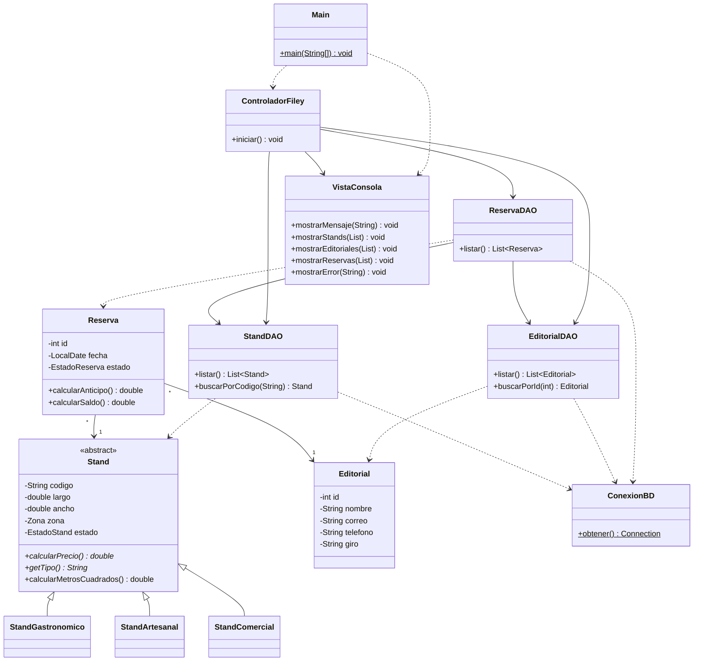

# Diagrama de clases (PD4: MVC + BD)

```mermaid
classDiagram
    class Stand {
        <<abstract>>
        -String codigo
        -double largo
        -double ancho
        -Zona zona
        -EstadoStand estado
        +calcularPrecio()* double
        +getTipo()* String
        +calcularMetrosCuadrados() double
    }
    class StandGastronomico
    class StandArtesanal
    class StandComercial
    class Editorial {
        -int id
        -String nombre
        -String correo
        -String telefono
        -String giro
    }
    class Reserva {
        -int id
        -LocalDate fecha
        -EstadoReserva estado
        +calcularAnticipo() double
        +calcularSaldo() double
    }
    class ConexionBD {
        +obtener()$ Connection
    }
    class StandDAO {
        +listar() List~Stand~
        +buscarPorCodigo(String) Stand
    }
    class EditorialDAO {
        +listar() List~Editorial~
        +buscarPorId(int) Editorial
    }
    class ReservaDAO {
        +listar() List~Reserva~
    }
    class ControladorFiley {
        +iniciar() void
    }
    class VistaConsola {
        +mostrarMensaje(String) void
        +mostrarStands(List) void
        +mostrarEditoriales(List) void
        +mostrarReservas(List) void
        +mostrarError(String) void
    }
    class Main {
        +main(String[])$ void
    }

    Stand <|-- StandGastronomico
    Stand <|-- StandArtesanal
    Stand <|-- StandComercial
    Reserva "*" --> "1" Stand
    Reserva "*" --> "1" Editorial
    StandDAO ..> ConexionBD
    EditorialDAO ..> ConexionBD
    ReservaDAO ..> ConexionBD
    StandDAO ..> Stand
    EditorialDAO ..> Editorial
    ReservaDAO ..> Reserva
    ReservaDAO --> StandDAO
    ReservaDAO --> EditorialDAO
    ControladorFiley --> StandDAO
    ControladorFiley --> EditorialDAO
    ControladorFiley --> ReservaDAO
    ControladorFiley --> VistaConsola
    Main ..> ControladorFiley
    Main ..> VistaConsola
```
